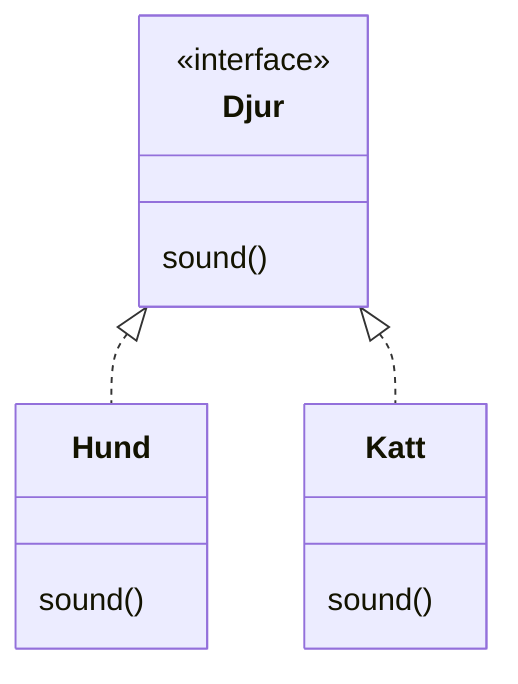

# Interface
Ett **interface** är en abstrakt typ. Det är för att den definerar en uppsättning metoder utan att implementera dem, d.v.s, [[Ordlista#abstrakta metoder|abstrakta metoder]].

Ett interface är **ingen klass** och man kan inte [[Ordlista#instansiera|instansiera]] ett interface.  

En klass som implementerar interfacet måste implementera alla [[ordlista#abstrakta metoder|abstrakta metoder]] som finns i interfacet. 

När vi deklarerar variabler anger vi deras typ. För [[Ordlista#referensvariabel|referensvariabel]] används klass eller interfacenamn som typ.

## Exempel
Antag att man i en program hanterar djur. Alla djur låter och så man vill vara säker på att de har en metod `sound()`.  

Vi kan lösa det genom att skapa ett [[#interface]] `Djur` med en [[Ordlista#abstrakta metoder|abstrakt metod]] `sound()` och låter klasserna `Hund` och `Katt` implementera interfacet med nyckelordet `implements`.  

```java
interface Djur {
    void sound();  // Alla klasser som implementerar detta måste ha denna metod
}

class Hund implements Djur {
    @Override
    public void sound() { // Klass Hund implementerar metoden
        System.out.println("Hunden skäller: Voff voff!");
    }
}

class Katt implements Djur {
    @Override
    public void sound() { // Klass Katt implementerar metoden
        System.out.println("Katten jamar: Mjau mjau!");
    }
}
```
^Interfacedjur



En annan lösning är att skapa en gemensam superklass med en [[Ordlista#abstrakta metoder|abstrakt metod]] `ljud()` men `Hund` och `Katt` har inga gemensamma metoder och attribut som kan flyttas upp till superklassen och därför är det onödigt.

## Deklarera Interface
* En interface finns i en egen fil (om den är `public`) och kompileras.
* En interface kan innehålla en eller fler [[ordlista#abstrakta metoder|abstrakta metoder]], [[ordlista#konstant|konstanter]], [[ordlista#statisk metod|statiska metoder]], [[ordlista#default-metod|default-metoder]]. 
* Metoderna i en interface är redan `public` och `abstract` så man behöver inte skriva det.

## Implementera flera Interface
En [[ordlista#klass|klass]] kan implementera flera interface men kan endast ärva från en klass.

```java
public class Hund extends Canis implements Djur, Varelse {
  ... //här implementeras allt i klassen Canis och interface Djur och Varelse
}
```

## Personlig Notis
Jag har undrat varför man behöver interface om de fungerar typ endast som en mall. Det som jag har kommit fram till är att interface inte är så användbar om man gör små projekt själv. Men om jag jobbar på samma projekt med 10+ personer och det finns tusentals rader kod så vill jag att alla måste följa en mall. Då är det kompilatorn som ser till att vi jobbar som vi ska.
